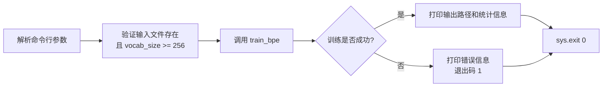
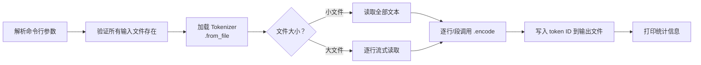
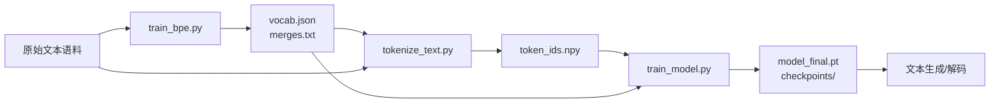

# 实现流程与关键函数使用指南

本文档为三个核心脚本 (`train_bpe.py`、`tokenize_text.py`、`train_model.py`) 提供：
1. **实现流程** — 代码执行的完整步骤流
2. **关键函数使用方法** — 各模块函数签名、输入输出说明及调用方式

---

## 1. `train_bpe.py` — BPE Tokenizer 训练脚本

### 1.1 实现流程



**详细步骤：**

1. **参数解析** — 使用 `argparse` 解析输入路径、词表大小、特殊 token、输出目录、worker 数。
2. **输入验证** — 检查输入文件是否存在、可读；确保 `vocab_size >= 256 + 特殊 token 数`。
3. **调用训练函数** — 执行 `train_bpe(input_path, vocab_size, special_tokens, output_dir, num_workers)`。
4. **输出报告** — 打印词表大小、合并规则数量、输出文件路径、各阶段耗时。
5. **错误处理** — 捕获 `FileNotFoundError`、`PermissionError`、`OSError` 等，退出码为 1。

### 1.2 关键函数使用方法

#### `train_bpe()`

```
cs336_basics.tokenizer.train_bpe(
    input_path: str,           # 训练语料文件路径（UTF-8）
    vocab_size: int,           # 目标词表大小（需 >= 256 + len(special_tokens)）
    special_tokens: list[str], # 特殊 token 列表，如 ["<|endoftext|>"]
    output_dir: str | None,    # 输出目录，自动保存 vocab.json 和 merges.txt
    num_workers: int | None,   # 并行 worker 数，None 时自动选择 min(cpu_count, 8)
) -> tuple[
    dict[int, bytes],          # 词表映射：{token_id: bytes}
    list[tuple[bytes, bytes]]  # 有序合并规则列表
]
```

- 内部已处理：文本加载、预分词、计数、堆构建、增量训练循环、计时、进度条。
- 当 `output_dir` 不为 None 时，自动调用 `save_tokenizer` 持久化结果。

#### `save_tokenizer()`

```
cs336_basics.tokenizer.save_tokenizer(
    vocab: dict[int, bytes],   # token_id → bytes
    merges: list[tuple[bytes, bytes]],  # 合并规则
    output_dir: str,           # 输出目录
) -> None
```

- 在 `output_dir` 下生成 `vocab.json`（十六进制编码）和 `merges.txt`（每行一个 hex pair）。

#### 脚本中预期调用方式

```python
# 1. 解析参数
# 2. 调用训练函数
vocab, merges = train_bpe(input_path, vocab_size, special_tokens, output_dir, num_workers)
# 3. 打印结果（词表大小、合并数、耗时等）
```

---

## 2. `tokenize_text.py` — 文本分词脚本

### 2.1 实现流程



**详细步骤：**

1. **参数解析** — 输入文本路径、词表文件、合并文件、输出文件、特殊 token、流式模式标志。
2. **加载 tokenizer** — 使用 `Tokenizer.from_file(vocab_path, merges_path, special_tokens)`。
3. **读取与分词** — 根据文件大小选择整体读取或逐行流式处理。
4. **输出** — 每行写入空格分隔的 token ID 序列。
5. **报告** — 输出总 token 数和处理速度。

### 2.2 关键函数使用方法

#### `Tokenizer.from_file()`

```
cs336_basics.tokenizer.Tokenizer.from_file(
    vocab_filepath: str,    # 词表文件路径
    merges_filepath: str,   # 合并文件路径
    special_tokens: list[str] | None,  # 特殊 token
) -> Tokenizer
```

- 类方法，工厂函数，从文件加载并返回 Tokenizer 实例。
- **注意**：当前 `from_file` 实现期望纯文本格式（每行 `token_id` 或 `token1 token2`），而非 `save_tokenizer` 生成的 hex-JSON 格式。你可能需要编写适配加载器。

#### `Tokenizer.encode()`

```
tokenizer.encode(
    text: str,               # 输入文本
) -> list[int]               # token ID 列表
```

- 对单个字符串进行完整 BPE 编码，返回整数 ID 列表。
- 内部自动处理特殊 token 的保留。

#### `Tokenizer.encode_iterable()`

```
tokenizer.encode_iterable(
    iterable: Iterable[str], # 字符串迭代器
) -> Iterable[int]           # token ID 的惰性生成器
```

- 对可迭代对象流式编码，适合逐行处理大文件。
- 返回生成器，不一次性将所有 ID 加载到内存。

#### 脚本中预期调用方式

```python
# 1. 加载 tokenizer
tokenizer = Tokenizer.from_file(vocab_path, merges_path, special_tokens)

# 2. 方式一：小文件整体处理
with open(input_path) as f:
    text = f.read()
tokens = tokenizer.encode(text)

# 方式二：大文件流式处理
with open(output_path, "w") as out:
    for line in open(input_path):
        ids = tokenizer.encode(line.rstrip("\n"))
        out.write(" ".join(map(str, ids)) + "\n")
        # 或使用 encode_iterable:
        # for id_ in tokenizer.encode_iterable([line.rstrip("\n")]): ...
```

---

## 3. `train_model.py` — 模型训练脚本

### 3.1 实现流程

```mermaid
flowchart TD
    A[解析所有 CLI 参数] --> B[设置随机种子]
    B --> C[初始化 W&B]
    C --> D[加载预分词数据\n.npy -> numpy array]
    D --> E[构建 TransformerLM 模型]
    E --> F[构建 AdamW 优化器]
    F --> G[创建学习率调度器]
    G --> H{是否有 checkpoint\n需要恢复?}
    H -->|是| I[load_checkpoint\n恢复模型、优化器、步数]
    H -->|否| J[从步数 0 开始]
    I --> K[进入训练循环]
    J --> K
    K --> L[data_loading 获取批次]
    L --> M[前向传播: logits = model(inputs)]
    M --> N[计算损失: cross_entropy]
    N --> O[反向传播: loss.backward]
    O --> P[梯度裁剪]
    P --> Q[optimizer.step]
    Q --> R[更新学习率]
    R --> S[日志记录\n控制台 + W&B]
    S --> T{达到保存间隔?}
    T -->|是| U[save_checkpoint]
    T -->|否| V{达到总步数?}
    U --> V
    V -->|否| K
    V -->|是| W[保存最终模型\n用于解码]
    W --> X[wandb.finish]
```

### 3.2 关键函数使用方法

#### `TransformerLM()`

```
cs336_basics.modules.TransformerLM(
    vocab_size: int,            # 词表大小
    context_length: int,        # 最大上下文长度（序列长度）
    d_model: int,               # 隐藏层维度
    num_layers: int,            # Transformer 块数量
    num_heads: int,             # 注意力头数
    d_ff: int,                  # FFN 隐藏层维度
    rope_theta: float,          # RoPE 基频
    device: torch.device | None,
    dtype: torch.dtype | None,
) -> TransformerLM
```

**前向传播：**
```
model(
    x: Int[Tensor, "batch seq_len"]   # 输入 token ID
) -> Float[Tensor, "batch seq_len vocab_size"]  # logits
```

- 输入是 `torch.long` 类型的整数 ID 张量。
- 输出是未归一化的 logits（`CrossEntropyLoss` 内部会做 softmax）。

#### `AdamW()`

```
cs336_basics.trainer.AdamW(
    params,                        # model.parameters()
    lr: float,                     # 学习率
    betas: tuple[float, float],    # (beta1, beta2)
    eps: float,                    # Adam epsilon
    weight_decay: float,           # 权重衰减
) -> AdamW
```

- 继承自 `torch.optim.Optimizer`，标准 `step()` 接口。
- 实现了权重衰减与梯度更新的解耦。

**训练循环中使用方式：**
```python
optimizer = AdamW(model.parameters(), lr=3e-4, betas=(0.9, 0.95), eps=1e-8, weight_decay=0.1)
# 每步：
optimizer.zero_grad()
loss.backward()
gradient_clipping(model.parameters(), max_grad_norm)
optimizer.step()
```

#### `cross_entropy()`

```
cs336_basics.trainer.cross_entropy(
    out_logits: Float[Tensor, "batch seq_len vocab_size"],
    targets: Int[Tensor, "batch seq_len"],
) -> Float[Tensor, ""]  # 标量损失
```

- 计算输出 logits 与目标 token ID 之间的交叉熵损失。
- 内部实现了数值稳定的 log-softmax。
- 返回批次中所有 token 的平均损失（标量）。

#### `get_lr_cosine_schedule()`

```
cs336_basics.trainer.get_lr_cosine_schedule(
    t: int,         # 当前步数
    lr_max: float,  # 峰值学习率
    lr_min: float,  # 最小学习率（余弦退火目标）
    t_warm: int,    # 预热步数
    t_end: int,     # 总步数
) -> float          # 当前步的学习率
```

- `t < t_warm` 时：线性预热，`lr = t / t_warm * lr_max`
- `t_warm <= t <= t_end` 时：余弦退火从 `lr_max` 衰减到 `lr_min`
- `t > t_end` 时：返回 `lr_min`

**训练循环中使用方式：**
```python
# 每步更新学习率
current_lr = get_lr_cosine_schedule(step, lr, lr_min, warmup_steps, total_steps)
optimizer.param_groups[0]['lr'] = current_lr
```

#### `gradient_clipping()`

```
cs336_basics.trainer.gradient_clipping(
    parameters: Iterable[torch.nn.Parameter],  # model.parameters()
    max_l2_norm: float,                        # 最大 L2 范数
) -> None
```

- 计算所有参数梯度的全局 L2 范数。
- 如果范数超过 `max_l2_norm`，将所有梯度等比例缩放。
- 直接修改 `param.grad.data`，无需返回值。

**训练循环中使用方式：**
```python
loss.backward()
gradient_clipping(model.parameters(), max_grad_norm)
optimizer.step()
```

#### `data_loading()`

```
cs336_basics.trainer.data_loading(
    dataset: npt.NDArray,     # 预分词的一维 numpy 数组
    batch_size: int,          # 批次大小
    context_length: int,      # 序列长度
    device: str,              # 目标设备（如 "cuda" 或 "cpu"）
) -> tuple[
    Int[Tensor, "batch seq_len"],     # 输入序列
    Int[Tensor, "batch seq_len"],     # 目标序列（右移一位）
]
```

- 从数据集中随机采样 `batch_size` 个连续片段。
- `inputs[i] = dataset[start:start+seq_len]`
- `targets[i] = dataset[start+1:start+seq_len+1]`
- 批次直接创建在目标设备上。

**训练循环中使用方式：**
```python
inputs, targets = data_loading(dataset, batch_size, context_length, device)
logits = model(inputs)
loss = cross_entropy(logits, targets)
```

#### `save_checkpoint()` / `load_checkpoint()`

```
# 保存
cs336_basics.trainer.save_checkpoint(
    model: torch.nn.Module,       # 模型
    optimizer: torch.optim.Optimizer,  # 优化器
    iteration: int,               # 当前训练步数
    out,                          # 输出路径或文件对象
) -> None

# 加载
cs336_basics.trainer.load_checkpoint(
    src,                          # checkpoint 路径或文件对象
    model: torch.nn.Module,       # 模型实例（已构建）
    optimizer: torch.optim.Optimizer,  # 优化器实例（已构建）
) -> int                          # 恢复的步数
```

- `save_checkpoint` 序列化 `model.state_dict()`、`optimizer.state_dict()` 和迭代步数。
- `load_checkpoint` 将状态恢复到模型和优化器中，返回保存时的步数。

### 3.3 W&B 集成流程

```
初始化阶段：
  1. 检查 --wandb-disable 标志
  2. wandb.init(project, name, entity, config=所有超参数)
  3. 如果禁用：wandb.init(mode="disabled")

训练循环（每 log_interval 步）：
  1. 收集指标：loss.item(), perplexity, current_lr, grad_norm, tokens_per_sec
  2. wandb.log({"loss": ..., "perplexity": ..., "step": step})

结束阶段：
  1. wandb.finish()
```

### 3.4 模型导出流程

```python
# 训练完成后，将最终模型保存为用于解码的格式
torch.save({
    "model_state_dict": model.state_dict(),        # 模型权重
    "model_config": {                              # 架构配置（重建模型时必需）
        "vocab_size": vocab_size,
        "context_length": context_length,
        "d_model": d_model,
        "num_layers": num_layers,
        "num_heads": num_heads,
        "d_ff": d_ff,
        "rope_theta": rope_theta,
    },
    "final_loss": loss.item(),                     # 最终损失
    "final_step": step,                            # 最终步数
}, args.export_final)
```

---

## 4. 脚本之间的数据流关系



- `train_bpe.py` 从原始文本训练 tokenizer，产出词表和合并规则。
- `tokenize_text.py` 使用训练好的 tokenizer 将文本转为整数 ID 数组。
- `train_model.py` 加载 token ID 数据训练 TransformerLM，产出模型权重供后续解码。
